# Atlas Platform - Documentación de Flujos End-to-End

## Tabla de Contenidos
1. [Introducción y Alcance](#1-introducción-y-alcance)
2. [Fuente de Verdad y Supuestos](#2-fuente-de-verdad-y-supuestos)
3. [ERD del Esquema](#3-erd-del-esquema)
4. [Catálogo de Entidades](#4-catálogo-de-entidades)
5. [Flujos End-to-End](#5-flujos-end-to-end)
6. [Estados y Transiciones](#6-estados-y-transiciones)
7. [Matriz de Trazabilidad](#7-matriz-de-trazabilidad)
8. [Casos Borde y Validaciones](#8-casos-borde-y-validaciones)
9. [Checklist de Pruebas Manuales](#9-checklist-de-pruebas-manuales)
10. [GAPs y Propuestas](#10-gaps-y-propuestas)
11. [Pre-Registro Externo de Administradores](#11-pre-registro-externo-de-administradores)

---

## 1. Introducción y Alcance

### 1.1 Descripción del Sistema

**Atlas Platform** es un backend para administración de organizaciones residenciales (condominos) que soporta:
- **Ciudadelas**: Zonas → Torres → Apartamentos
- **Conjuntos Cerrados**: Zonas (opcional) → Casas

### 1.2 Alcance Funcional

| Fase | Descripción |
|------|-------------|
| **Fase 1** | Registro + Creación de Organización (Onboarding Admin) |
| **Fase 2** | Configuración de Estructura Residencial (Zonas/Torres/Unidades) |
| **Fase 3** | Invitaciones y Vinculación de Residentes |
| **Fase 4** | Solicitud de Ingreso (Visit Control) + Aprobación + QR/PDF |
| **Fase 5** | Posts/Comentarios/Encuestas ✅ **IMPLEMENTADO** (V4 Migration) |
| **Fase 6** | Pre-Registro Externo de Administradores ✅ **IMPLEMENTADO** (V5 Migration) |

### 1.3 Tecnologías

- **Spring Boot WebFlux** (reactivo)
- **Java 21**
- **MySQL 8.0** via R2DBC
- **Flyway** para migraciones
- **JWT** para autenticación
- **Clean Architecture** (Bancolombia Plugin)

---

## 2. Fuente de Verdad y Supuestos

### 2.1 Fuentes Analizadas

| Fuente | Archivo | Estado |
|--------|---------|--------|
| **Migración V1** | `V1__create_initial_schema.sql` | ✅ Analizado |
| **Migración V2** | `V2__create_units_visits_schema.sql` | ✅ Analizado |
| **Migración V3** | `V3__seed_initial_data.sql` | ✅ Analizado |
| **Migración V4** | `V4__create_posts_polls_schema.sql` | ✅ Implementado |
| **Migración V5** | `V5__create_admin_preregistration_schema.sql` | ✅ Implementado |
| **AuthRouterRest** | `api/auth/AuthRouterRest.java` | ✅ Implementado |
| **AuthHandler** | `api/auth/AuthHandler.java` | ✅ Implementado |
| **LoginUseCase** | `usecase/auth/LoginUseCase.java` | ✅ Implementado |
| **AuthUserRepositoryAdapter** | `r2dbc/authuser/AuthUserRepositoryAdapter.java` | ✅ Implementado |
| **ExternalAdminRouterRest** | `api/external/ExternalAdminRouterRest.java` | ✅ Implementado |
| **ExternalAdminHandler** | `api/external/ExternalAdminHandler.java` | ✅ Implementado |
| **PreRegisterAdminUseCase** | `usecase/admin/PreRegisterAdminUseCase.java` | ✅ Implementado |
| **ActivateAdminUseCase** | `usecase/admin/ActivateAdminUseCase.java` | ✅ Implementado |
| **CompleteOnboardingUseCase** | `usecase/admin/CompleteOnboardingUseCase.java` | ✅ Implementado |

### 2.2 Convención de Nombres

| Entidad | Nombre Exacto (Flyway) |
|---------|------------------------|
| Usuarios | `users` |
| Roles | `role` |
| Asignación global de roles | `user_role` |
| Empresas | `company` |
| Organizaciones | `organization` |
| Zonas | `zone` |
| Torres | `tower` |
| Unidades | `unit` |
| Módulos | `modules` |
| Módulos por organización | `organization_modules` |
| Permisos | `permissions` |
| Permisos por rol | `role_permissions` |
| Membresía multi-tenant | `user_organizations` |
| Roles multi-tenant | `user_roles_multi` |
| Usuarios en unidades | `user_units` |
| Permisos por unidad | `user_unit_permissions` |
| Invitaciones | `invitations` |
| Solicitudes de visita | `visit_requests` |
| Aprobaciones | `visit_approvals` |
| Códigos de acceso | `access_codes` |
| Log de escaneo | `access_scan_log` |

### 2.3 Supuestos

1. **Las migraciones Flyway son la fuente de verdad absoluta**.
2. El backend solo tiene implementado el módulo de autenticación (login, refresh, verify).
3. Las demás funcionalidades (CRUD de organizaciones, unidades, invitaciones, visitas) **NO ESTÁN IMPLEMENTADAS**.
4. No existe MER/MEB externo; este documento genera el ERD desde Flyway.

---

## 3. ERD del Esquema

### 3.1 Diagrama Entidad-Relación (Mermaid)

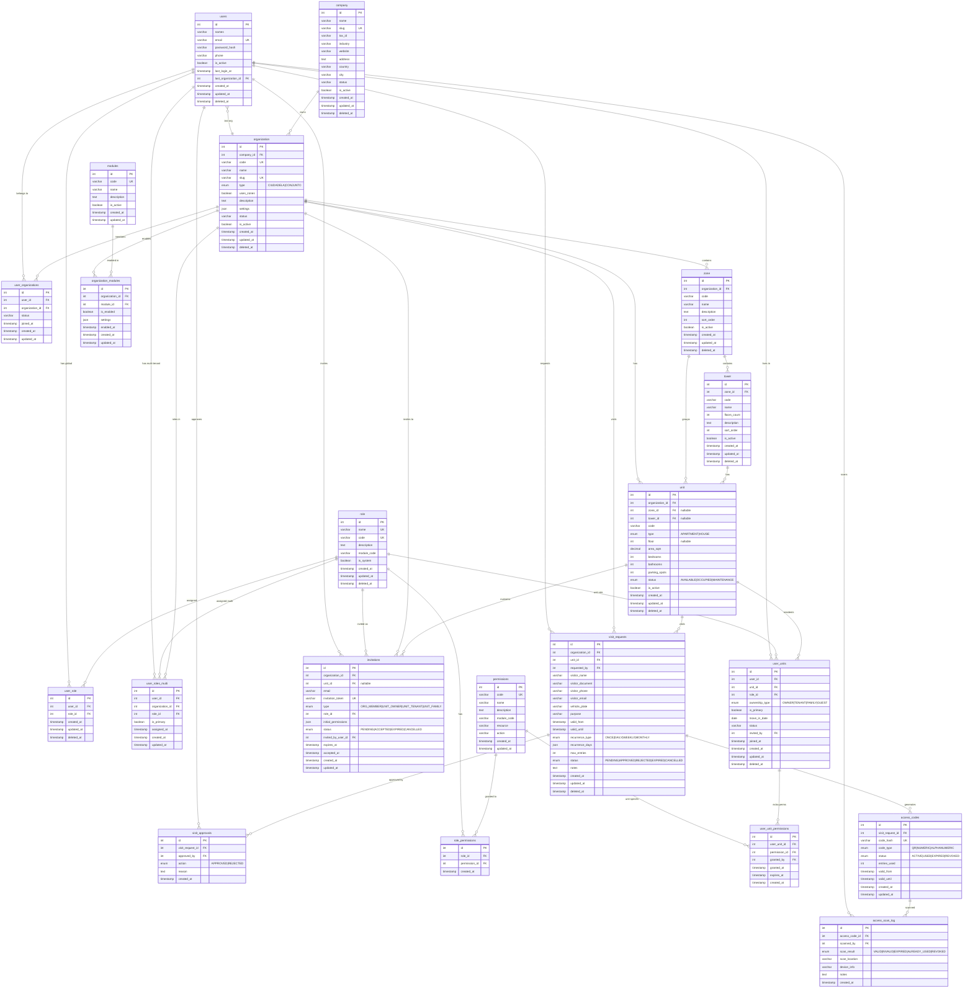

---

## 4. Catálogo de Entidades

### 4.1 users

**Propósito**: Almacena usuarios del sistema.

| Columna | Tipo | Null | Default | Descripción |
|---------|------|------|---------|-------------|
| id | INT | NO | AUTO_INCREMENT | PK |
| names | VARCHAR(120) | NO | - | Nombre completo |
| email | VARCHAR(160) | NO | - | Email único |
| password_hash | VARCHAR(255) | SI | - | Hash BCrypt |
| phone | VARCHAR(40) | SI | - | Teléfono |
| is_active | BOOLEAN | NO | TRUE | Usuario activo |
| last_login_at | TIMESTAMP | SI | - | Último login |
| last_organization_id | INT | SI | - | FK a organization |
| created_at | TIMESTAMP | SI | CURRENT_TIMESTAMP | Creación |
| updated_at | TIMESTAMP | SI | CURRENT_TIMESTAMP | Actualización |
| deleted_at | TIMESTAMP | SI | - | Soft delete |

**Índices**:
- `idx_users_email` ON (email)
- `idx_users_last_organization_id` ON (last_organization_id)

**Reglas de Negocio**:
- Email debe ser único.
- `password_hash` usa BCrypt ($2a$10$...).
- Soft delete con `deleted_at IS NULL` en queries.

**Referencia Backend**: 
- Entity: `r2dbc/authuser/AuthUserEntity.java`
- Repository: `r2dbc/authuser/AuthUserRepositoryAdapter.java`

---

### 4.2 role

**Propósito**: Define roles del sistema (SUPER_ADMIN, ADMIN_ATLAS, OWNER, etc.).

| Columna | Tipo | Null | Default | Descripción |
|---------|------|------|---------|-------------|
| id | INT | NO | AUTO_INCREMENT | PK |
| name | VARCHAR(40) | NO | - | Nombre único |
| code | VARCHAR(50) | SI | - | Código único (ej: SUPER_ADMIN) |
| description | TEXT | SI | - | Descripción |
| module_code | VARCHAR(50) | SI | - | Módulo asociado (ATLAS_CORE, etc.) |
| is_system | BOOLEAN | NO | FALSE | Rol del sistema (no editable) |
| created_at | TIMESTAMP | SI | CURRENT_TIMESTAMP | Creación |
| updated_at | TIMESTAMP | SI | CURRENT_TIMESTAMP | Actualización |
| deleted_at | TIMESTAMP | SI | - | Soft delete |

**Roles Semilla (V3)**:
| code | name | module_code | is_system |
|------|------|-------------|-----------|
| SUPER_ADMIN | Super Administrador | NULL | TRUE |
| ADMIN_ATLAS | Administrador Atlas | ATLAS_CORE | TRUE |
| OWNER | Propietario | ATLAS_CORE | TRUE |
| TENANT | Arrendatario | ATLAS_CORE | TRUE |
| FAMILY | Familiar | ATLAS_CORE | TRUE |
| GUEST | Invitado | ATLAS_CORE | TRUE |
| SECURITY | Seguridad | ACCESS_CONTROL | TRUE |

**Referencia Backend**: 
- Model: `model/role/Role.java`

---

### 4.3 company

**Propósito**: Holding de organizaciones.

| Columna | Tipo | Null | Default | Descripción |
|---------|------|------|---------|-------------|
| id | INT | NO | AUTO_INCREMENT | PK |
| name | VARCHAR(160) | NO | - | Nombre |
| slug | VARCHAR(100) | SI | - | URL slug único |
| tax_id | VARCHAR(40) | SI | - | NIT/RUT |
| industry | VARCHAR(120) | SI | - | Industria |
| website | VARCHAR(255) | SI | - | Sitio web |
| address | TEXT | SI | - | Dirección |
| country | VARCHAR(80) | SI | - | País |
| city | VARCHAR(80) | SI | - | Ciudad |
| status | VARCHAR(50) | NO | ACTIVE | Estado |
| is_active | BOOLEAN | SI | TRUE | Activo |
| created_at | TIMESTAMP | SI | CURRENT_TIMESTAMP | Creación |
| updated_at | TIMESTAMP | SI | CURRENT_TIMESTAMP | Actualización |
| deleted_at | TIMESTAMP | SI | - | Soft delete |

**Referencia Backend**: NO IMPLEMENTADO

---

### 4.4 organization

**Propósito**: Ciudadela o Conjunto Residencial.

| Columna | Tipo | Null | Default | Descripción |
|---------|------|------|---------|-------------|
| id | INT | NO | AUTO_INCREMENT | PK |
| company_id | INT | NO | - | FK a company |
| code | VARCHAR(50) | NO | - | Código único |
| name | VARCHAR(160) | NO | - | Nombre |
| slug | VARCHAR(100) | SI | - | URL slug |
| type | ENUM | NO | - | CIUDADELA o CONJUNTO |
| uses_zones | BOOLEAN | NO | TRUE | Si usa zonas |
| description | TEXT | SI | - | Descripción |
| settings | JSON | SI | - | Configuraciones |
| status | VARCHAR(50) | NO | ACTIVE | Estado |
| is_active | BOOLEAN | SI | TRUE | Activo |
| created_at | TIMESTAMP | SI | CURRENT_TIMESTAMP | Creación |
| updated_at | TIMESTAMP | SI | CURRENT_TIMESTAMP | Actualización |
| deleted_at | TIMESTAMP | SI | - | Soft delete |

**Valores del ENUM type**:
- `CIUDADELA`: Tiene zonas → torres → apartamentos
- `CONJUNTO`: Tiene zonas (opcional) → casas

**Referencia Backend**: NO IMPLEMENTADO

---

### 4.5 zone

**Propósito**: Zonas dentro de una organización.

| Columna | Tipo | Null | Default | Descripción |
|---------|------|------|---------|-------------|
| id | INT | NO | AUTO_INCREMENT | PK |
| organization_id | INT | NO | - | FK a organization |
| code | VARCHAR(50) | NO | - | Código único por org |
| name | VARCHAR(100) | NO | - | Nombre |
| description | TEXT | SI | - | Descripción |
| sort_order | INT | NO | 0 | Orden |
| is_active | BOOLEAN | NO | TRUE | Activo |
| created_at | TIMESTAMP | SI | CURRENT_TIMESTAMP | Creación |
| updated_at | TIMESTAMP | SI | CURRENT_TIMESTAMP | Actualización |
| deleted_at | TIMESTAMP | SI | - | Soft delete |

**Índice Único**: `idx_zone_org_code` ON (organization_id, code)

**Referencia Backend**: NO IMPLEMENTADO

---

### 4.6 tower

**Propósito**: Torres dentro de una zona (solo para CIUDADELA).

| Columna | Tipo | Null | Default | Descripción |
|---------|------|------|---------|-------------|
| id | INT | NO | AUTO_INCREMENT | PK |
| zone_id | INT | NO | - | FK a zone |
| code | VARCHAR(50) | NO | - | Código único por zona |
| name | VARCHAR(100) | NO | - | Nombre |
| floors_count | INT | SI | - | Número de pisos |
| description | TEXT | SI | - | Descripción |
| sort_order | INT | NO | 0 | Orden |
| is_active | BOOLEAN | NO | TRUE | Activo |
| created_at | TIMESTAMP | SI | CURRENT_TIMESTAMP | Creación |
| updated_at | TIMESTAMP | SI | CURRENT_TIMESTAMP | Actualización |
| deleted_at | TIMESTAMP | SI | - | Soft delete |

**Índice Único**: `idx_tower_zone_code` ON (zone_id, code)

**Referencia Backend**: NO IMPLEMENTADO

---

### 4.7 unit

**Propósito**: Unidad habitacional (Apartamento o Casa).

| Columna | Tipo | Null | Default | Descripción |
|---------|------|------|---------|-------------|
| id | INT | NO | AUTO_INCREMENT | PK |
| organization_id | INT | NO | - | FK a organization |
| zone_id | INT | SI | - | FK a zone (NULL si org no usa zonas) |
| tower_id | INT | SI | - | FK a tower (NULL si es conjunto) |
| code | VARCHAR(50) | NO | - | Código único por org |
| type | ENUM | NO | - | APARTMENT o HOUSE |
| floor | INT | SI | - | Piso (solo apartamentos) |
| area_sqm | DECIMAL(10,2) | SI | - | Área en m² |
| bedrooms | INT | SI | - | Habitaciones |
| bathrooms | INT | SI | - | Baños |
| parking_spots | INT | SI | - | Parqueaderos |
| status | ENUM | NO | AVAILABLE | Estado |
| is_active | BOOLEAN | NO | TRUE | Activo |
| created_at | TIMESTAMP | SI | CURRENT_TIMESTAMP | Creación |
| updated_at | TIMESTAMP | SI | CURRENT_TIMESTAMP | Actualización |
| deleted_at | TIMESTAMP | SI | - | Soft delete |

**Valores del ENUM type**: `APARTMENT`, `HOUSE`
**Valores del ENUM status**: `AVAILABLE`, `OCCUPIED`, `MAINTENANCE`

**Índice Único**: `idx_unit_org_code` ON (organization_id, code)

**Referencia Backend**: NO IMPLEMENTADO

---

### 4.8 modules

**Propósito**: Módulos del sistema habilitables por organización.

| Columna | Tipo | Null | Default | Descripción |
|---------|------|------|---------|-------------|
| id | INT | NO | AUTO_INCREMENT | PK |
| code | VARCHAR(50) | NO | - | Código único |
| name | VARCHAR(100) | NO | - | Nombre |
| description | TEXT | SI | - | Descripción |
| is_active | BOOLEAN | NO | TRUE | Activo |
| created_at | TIMESTAMP | SI | CURRENT_TIMESTAMP | Creación |
| updated_at | TIMESTAMP | SI | CURRENT_TIMESTAMP | Actualización |

**Módulos Semilla (V3)**:
| code | name |
|------|------|
| ATLAS_CORE | Atlas Core |
| VISIT_CONTROL | Control de Visitas |
| ACCESS_CONTROL | Control de Acceso |

**Referencia Backend**: `model/module/Module.java`

---

### 4.9 permissions

**Propósito**: Permisos granulares del sistema.

| Columna | Tipo | Null | Default | Descripción |
|---------|------|------|---------|-------------|
| id | INT | NO | AUTO_INCREMENT | PK |
| code | VARCHAR(100) | NO | - | Código único (RESOURCE_ACTION) |
| name | VARCHAR(100) | NO | - | Nombre |
| description | TEXT | SI | - | Descripción |
| module_code | VARCHAR(50) | SI | - | Módulo (NULL = global) |
| resource | VARCHAR(50) | NO | - | Recurso (units, visits, etc.) |
| action | VARCHAR(50) | NO | - | Acción (CREATE, READ, UPDATE, DELETE, MANAGE) |
| created_at | TIMESTAMP | SI | CURRENT_TIMESTAMP | Creación |
| updated_at | TIMESTAMP | SI | CURRENT_TIMESTAMP | Actualización |

**Permisos Semilla (V3)**: Ver migración para lista completa.

**Referencia Backend**: `model/permission/Permission.java`

---

### 4.10 invitations

**Propósito**: Invitaciones por token para unirse a organización/unidad.

| Columna | Tipo | Null | Default | Descripción |
|---------|------|------|---------|-------------|
| id | INT | NO | AUTO_INCREMENT | PK |
| organization_id | INT | NO | - | FK a organization |
| unit_id | INT | SI | - | FK a unit (NULL si invitación a nivel org) |
| email | VARCHAR(255) | NO | - | Email del invitado |
| invitation_token | VARCHAR(100) | NO | - | Token único |
| type | ENUM | NO | - | Tipo de invitación |
| role_id | INT | SI | - | FK a role |
| initial_permissions | JSON | SI | - | IDs de permisos adicionales |
| status | ENUM | NO | PENDING | Estado |
| invited_by_user_id | INT | NO | - | FK a users (quien invita) |
| expires_at | TIMESTAMP | NO | - | Expiración |
| accepted_at | TIMESTAMP | SI | - | Fecha de aceptación |
| created_at | TIMESTAMP | SI | CURRENT_TIMESTAMP | Creación |
| updated_at | TIMESTAMP | SI | CURRENT_TIMESTAMP | Actualización |

**Valores del ENUM type**: `ORG_MEMBER`, `UNIT_OWNER`, `UNIT_TENANT`, `UNIT_FAMILY`
**Valores del ENUM status**: `PENDING`, `ACCEPTED`, `EXPIRED`, `CANCELLED`

**Índice Único**: `idx_invitations_token` ON (invitation_token)

**Referencia Backend**: NO IMPLEMENTADO

---

### 4.11 user_units

**Propósito**: Vinculación de usuarios a unidades.

| Columna | Tipo | Null | Default | Descripción |
|---------|------|------|---------|-------------|
| id | INT | NO | AUTO_INCREMENT | PK |
| user_id | INT | NO | - | FK a users |
| unit_id | INT | NO | - | FK a unit |
| role_id | INT | NO | - | FK a role (rol dentro de la unidad) |
| ownership_type | ENUM | NO | - | Tipo de propiedad |
| is_primary | BOOLEAN | NO | FALSE | Si es propietario principal |
| move_in_date | DATE | SI | - | Fecha de ingreso |
| status | VARCHAR(50) | NO | ACTIVE | Estado |
| invited_by | INT | SI | - | FK a users (quien invitó) |
| joined_at | TIMESTAMP | NO | CURRENT_TIMESTAMP | Fecha de unión |
| created_at | TIMESTAMP | SI | CURRENT_TIMESTAMP | Creación |
| updated_at | TIMESTAMP | SI | CURRENT_TIMESTAMP | Actualización |
| deleted_at | TIMESTAMP | SI | - | Soft delete |

**Valores del ENUM ownership_type**: `OWNER`, `TENANT`, `FAMILY`, `GUEST`

**Índice Único**: `idx_user_units_user_unit` ON (user_id, unit_id)

**Referencia Backend**: NO IMPLEMENTADO

---

### 4.12 visit_requests

**Propósito**: Solicitudes de ingreso de visitantes.

| Columna | Tipo | Null | Default | Descripción |
|---------|------|------|---------|-------------|
| id | INT | NO | AUTO_INCREMENT | PK |
| organization_id | INT | NO | - | FK a organization |
| unit_id | INT | NO | - | FK a unit |
| requested_by | INT | NO | - | FK a users (quien solicita) |
| visitor_name | VARCHAR(200) | NO | - | Nombre del visitante |
| visitor_document | VARCHAR(50) | SI | - | Documento de identidad |
| visitor_phone | VARCHAR(40) | SI | - | Teléfono |
| visitor_email | VARCHAR(160) | SI | - | Email |
| vehicle_plate | VARCHAR(20) | SI | - | Placa del vehículo |
| purpose | VARCHAR(255) | SI | - | Propósito de la visita |
| valid_from | TIMESTAMP | NO | - | Inicio de validez |
| valid_until | TIMESTAMP | NO | - | Fin de validez |
| recurrence_type | ENUM | NO | ONCE | Tipo de recurrencia |
| recurrence_days | JSON | SI | - | Días de recurrencia [1,3,5] |
| max_entries | INT | SI | - | Máximo de entradas (NULL = ilimitado) |
| status | ENUM | NO | PENDING | Estado |
| notes | TEXT | SI | - | Notas |
| created_at | TIMESTAMP | SI | CURRENT_TIMESTAMP | Creación |
| updated_at | TIMESTAMP | SI | CURRENT_TIMESTAMP | Actualización |
| deleted_at | TIMESTAMP | SI | - | Soft delete |

**Valores del ENUM recurrence_type**: `ONCE`, `DAILY`, `WEEKLY`, `MONTHLY`
**Valores del ENUM status**: `PENDING`, `APPROVED`, `REJECTED`, `EXPIRED`, `CANCELLED`

**Referencia Backend**: NO IMPLEMENTADO

---

### 4.13 visit_approvals

**Propósito**: Registro de aprobaciones/rechazos de visitas.

| Columna | Tipo | Null | Default | Descripción |
|---------|------|------|---------|-------------|
| id | INT | NO | AUTO_INCREMENT | PK |
| visit_request_id | INT | NO | - | FK a visit_requests |
| approved_by | INT | NO | - | FK a users |
| action | ENUM | NO | - | APPROVED o REJECTED |
| reason | TEXT | SI | - | Razón del rechazo |
| created_at | TIMESTAMP | SI | CURRENT_TIMESTAMP | Creación |

**Valores del ENUM action**: `APPROVED`, `REJECTED`

**Referencia Backend**: NO IMPLEMENTADO

---

### 4.14 access_codes

**Propósito**: Códigos de acceso (QR) para visitantes.

| Columna | Tipo | Null | Default | Descripción |
|---------|------|------|---------|-------------|
| id | INT | NO | AUTO_INCREMENT | PK |
| visit_request_id | INT | NO | - | FK a visit_requests |
| code_hash | VARCHAR(255) | NO | - | Hash del código/QR |
| code_type | ENUM | NO | QR | Tipo de código |
| status | ENUM | NO | ACTIVE | Estado |
| entries_used | INT | NO | 0 | Entradas usadas |
| valid_from | TIMESTAMP | NO | - | Inicio de validez |
| valid_until | TIMESTAMP | NO | - | Fin de validez |
| created_at | TIMESTAMP | SI | CURRENT_TIMESTAMP | Creación |
| updated_at | TIMESTAMP | SI | CURRENT_TIMESTAMP | Actualización |

**Valores del ENUM code_type**: `QR`, `NUMERIC`, `ALPHANUMERIC`
**Valores del ENUM status**: `ACTIVE`, `USED`, `EXPIRED`, `REVOKED`

**Índice Único**: `idx_access_codes_hash` ON (code_hash)

**Referencia Backend**: NO IMPLEMENTADO

---

### 4.15 access_scan_log

**Propósito**: Historial de escaneos en portería.

| Columna | Tipo | Null | Default | Descripción |
|---------|------|------|---------|-------------|
| id | INT | NO | AUTO_INCREMENT | PK |
| access_code_id | INT | NO | - | FK a access_codes |
| scanned_by | INT | SI | - | FK a users (portero) |
| scan_result | ENUM | NO | - | Resultado del escaneo |
| scan_location | VARCHAR(100) | SI | - | Portería/punto de acceso |
| device_info | VARCHAR(255) | SI | - | Info del dispositivo |
| notes | TEXT | SI | - | Notas |
| created_at | TIMESTAMP | SI | CURRENT_TIMESTAMP | Creación |

**Valores del ENUM scan_result**: `VALID`, `INVALID`, `EXPIRED`, `ALREADY_USED`, `REVOKED`

**Referencia Backend**: NO IMPLEMENTADO

---

## 5. Flujos End-to-End

### 5.1 FASE 1: Autenticación (IMPLEMENTADO)

#### 5.1.1 Login

**Descripción**: Autenticación de usuario con email y contraseña.

**Precondiciones**:
- Usuario existe en tabla `users`
- Usuario está activo (`is_active = TRUE`)

**Endpoint**:
- **Ruta**: `POST /api/auth/login`
- **Auth**: Ninguna
- **Archivo**: `api/auth/AuthRouterRest.java` (línea 37-62)

**Request DTO** (`LoginRequest.java`):
```json
{
  "email": "admin@atlas.com",
  "password": "admin123"
}
```

**Response DTO** (`LoginResponse.java`):
```json
{
  "success": true,
  "status": 200,
  "message": "Autenticación exitosa",
  "data": {
    "accessToken": "eyJhbGciOiJIUzI1NiIsInR5cCI6IkpXVCJ9...",
    "refreshToken": "eyJhbGciOiJIUzI1NiIsInR5cCI6IkpXVCJ9...",
    "tokenType": "Bearer"
  }
}
```

**Impacto en DB**:
| Tabla | Columna | Acción |
|-------|---------|--------|
| users | last_login_at | UPDATE con timestamp actual |

**Diagrama de Secuencia**:

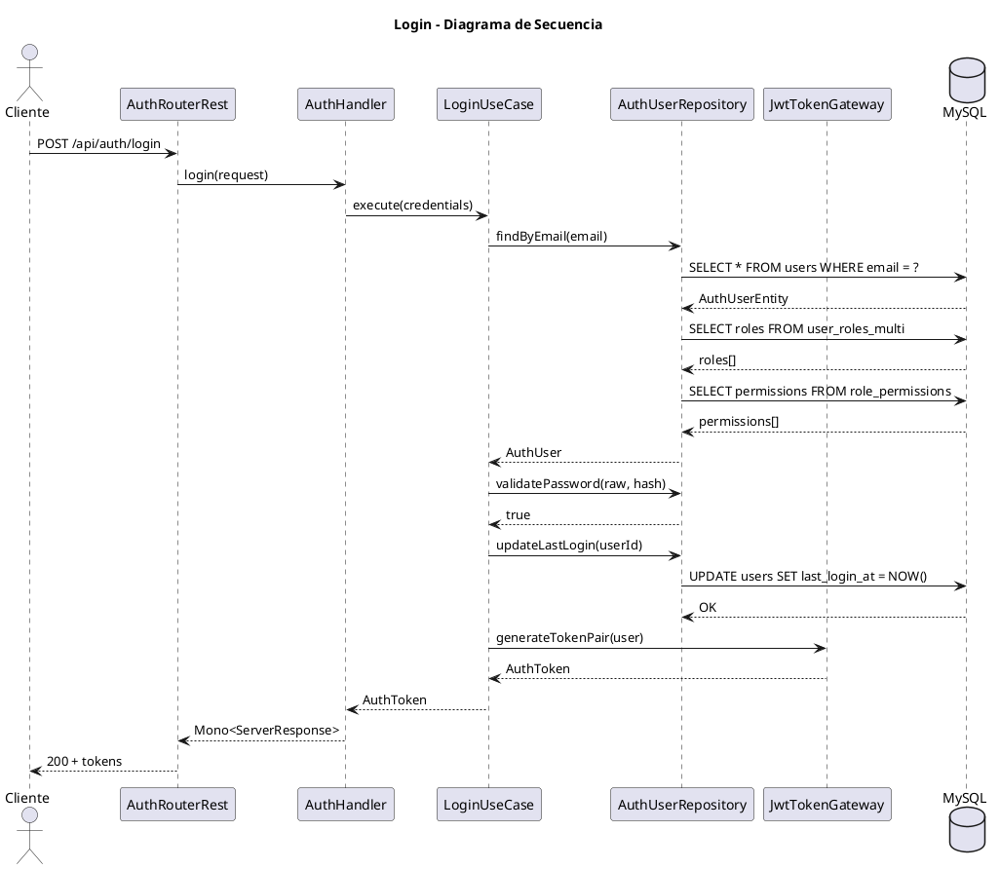

**SQL de Verificación**:
```sql
-- Verificar usuario logueado
SELECT id, email, last_login_at FROM users WHERE email = 'admin@atlas.com';
```

---

#### 5.1.2 Refresh Token

**Endpoint**:
- **Ruta**: `POST /api/auth/refresh`
- **Auth**: Ninguna
- **Archivo**: `api/auth/AuthRouterRest.java` (línea 63-87)

**Request**:
```json
{
  "refreshToken": "eyJhbGciOiJIUzI1NiIsInR5cCI6IkpXVCJ9..."
}
```

**Response**: Mismo formato que login.

---

#### 5.1.3 Verify Token

**Endpoint**:
- **Ruta**: `POST /api/auth/verify-token`
- **Auth**: Ninguna
- **Archivo**: `api/auth/AuthRouterRest.java` (línea 88-118)

**Request**:
```json
{
  "token": "eyJhbGciOiJIUzI1NiIsInR5cCI6IkpXVCJ9..."
}
```

**Response**:
```json
{
  "success": true,
  "status": 200,
  "message": "Token válido",
  "data": {
    "claims": {
      "userId": "1",
      "role": "SUPER_ADMIN"
    }
  }
}
```

---

### 5.2 FASE 1: Registro de Usuario (NO IMPLEMENTADO)

> ⚠️ **GAP**: No existe endpoint de registro. Ver sección [10. GAPs y Propuestas](#10-gaps-y-propuestas).

**Flujo Propuesto**:
1. Usuario envía datos de registro
2. Sistema valida email único
3. Sistema hashea password con BCrypt
4. Sistema crea registro en `users`
5. Sistema retorna usuario creado (sin tokens)

---

### 5.3 FASE 1: Creación de Company/Organization (NO IMPLEMENTADO)

> ⚠️ **GAP**: No existen endpoints para gestión de companies/organizations. Ver sección [10. GAPs y Propuestas](#10-gaps-y-propuestas).

---

### 5.4 FASE 2: Configuración de Estructura (NO IMPLEMENTADO)

> ⚠️ **GAP**: No existen endpoints para gestión de zones/towers/units. Ver sección [10. GAPs y Propuestas](#10-gaps-y-propuestas).

---

### 5.5 FASE 3: Invitaciones (NO IMPLEMENTADO)

> ⚠️ **GAP**: No existen endpoints para gestión de invitaciones. Ver sección [10. GAPs y Propuestas](#10-gaps-y-propuestas).

**Flujo Propuesto**:

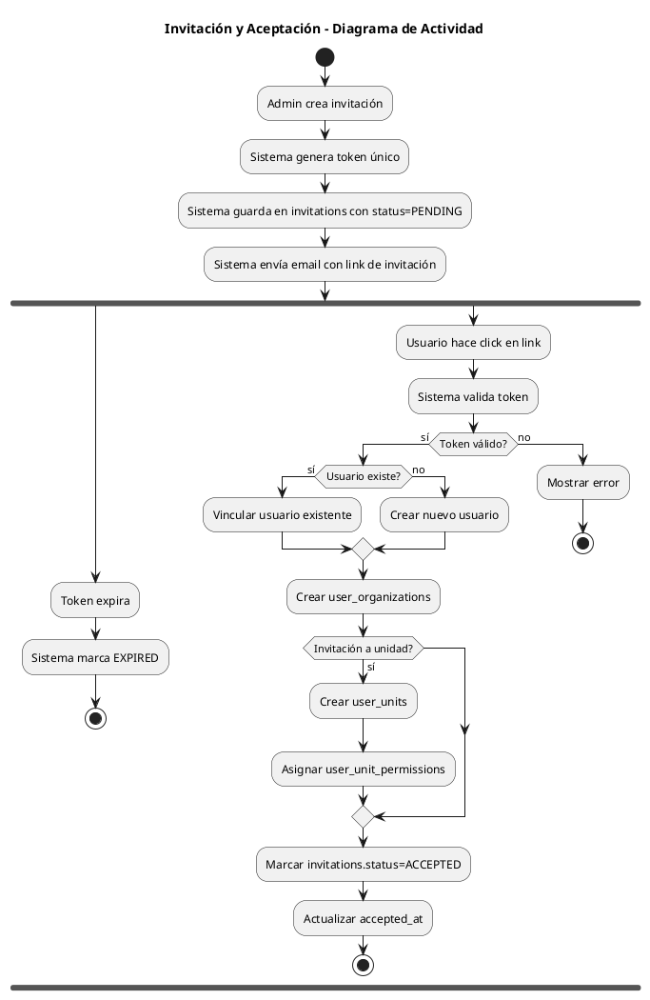

---

### 5.6 FASE 4: Solicitud de Visita (NO IMPLEMENTADO)

> ⚠️ **GAP**: No existen endpoints para gestión de visitas. Ver sección [10. GAPs y Propuestas](#10-gaps-y-propuestas).

**Diagrama de Actividad Propuesto**:

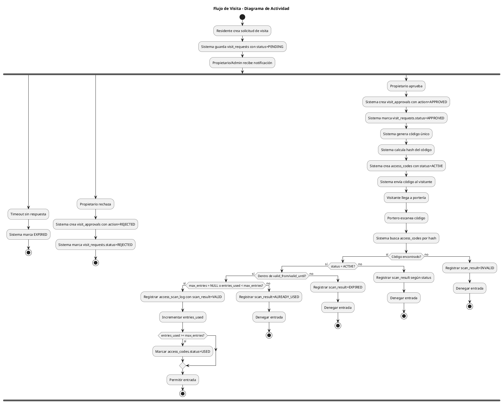

---

## 6. Estados y Transiciones

### 6.1 invitations.status

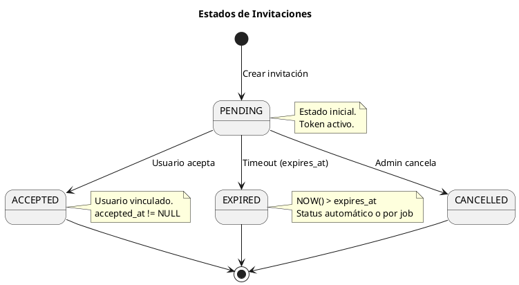

**Transiciones Válidas**:
| De | A | Trigger | Acción |
|----|---|---------|--------|
| - | PENDING | Crear invitación | Generar token, expires_at |
| PENDING | ACCEPTED | Accept endpoint | Crear user_organizations, user_units |
| PENDING | EXPIRED | Job o validación | Marcar expirado |
| PENDING | CANCELLED | Cancel endpoint | - |

---

### 6.2 visit_requests.status

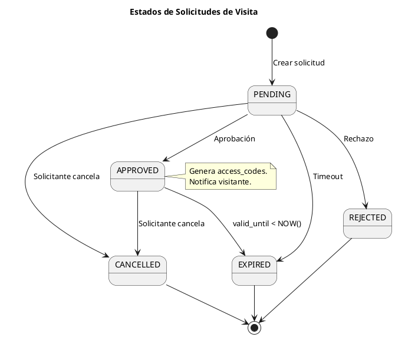

**Transiciones Válidas**:
| De | A | Trigger | Impacto |
|----|---|---------|---------|
| - | PENDING | Crear solicitud | - |
| PENDING | APPROVED | approve() | Crear visit_approvals, access_codes |
| PENDING | REJECTED | reject() | Crear visit_approvals con reason |
| PENDING | CANCELLED | cancel() | - |
| PENDING | EXPIRED | Job | - |
| APPROVED | EXPIRED | valid_until | Marcar access_codes.status=EXPIRED |
| APPROVED | CANCELLED | cancel() | Marcar access_codes.status=REVOKED |

---

### 6.3 access_codes.status

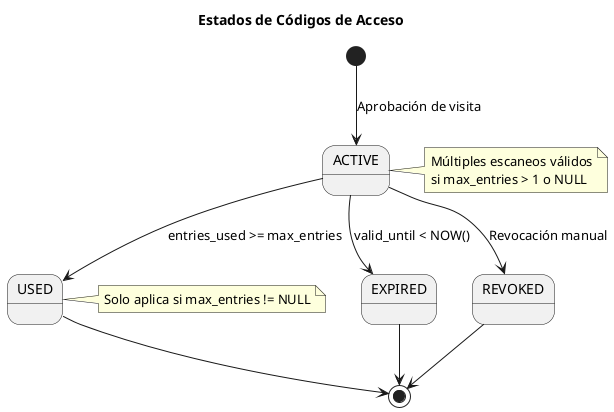

**Transiciones Válidas**:
| De | A | Trigger | Condición |
|----|---|---------|-----------|
| - | ACTIVE | Aprobar visita | - |
| ACTIVE | USED | Escaneo válido | entries_used >= max_entries |
| ACTIVE | EXPIRED | Job o scan | NOW() > valid_until |
| ACTIVE | REVOKED | revoke() | Manual |

---

## 7. Matriz de Trazabilidad

### 7.1 Endpoints Implementados

| Caso de Uso | Endpoint | DTO Request | DTO Response | Tablas | Permisos |
|-------------|----------|-------------|--------------|--------|----------|
| Login | POST /api/auth/login | LoginRequest | LoginResponse | users, user_roles_multi, role_permissions | Público |
| Refresh Token | POST /api/auth/refresh | RefreshTokenRequest | LoginResponse | - | Público |
| Verify Token | POST /api/auth/verify-token | VerifyTokenRequest | VerifyTokenResponse | - | Público |

### 7.2 Endpoints Pendientes (GAP)

| Caso de Uso | Endpoint Propuesto | Tablas | Permisos Requeridos |
|-------------|-------------------|--------|---------------------|
| Registro usuario | POST /api/auth/register | users | Público |
| Crear company | POST /api/companies | company | SUPER_ADMIN |
| Crear organization | POST /api/organizations | organization, organization_modules | SUPER_ADMIN, ADMIN_ATLAS |
| Listar organizations | GET /api/organizations | organization | Autenticado |
| Crear zona | POST /api/zones | zone | ZONES_CREATE |
| Listar zonas | GET /api/zones | zone | ZONES_READ |
| Crear torre | POST /api/towers | tower | TOWERS_CREATE |
| Crear unidad | POST /api/units | unit | UNITS_CREATE |
| Listar unidades | GET /api/units | unit | UNITS_READ |
| Crear invitación | POST /api/invitations | invitations | INVITATIONS_CREATE |
| Aceptar invitación | POST /api/invitations/:token/accept | invitations, user_organizations, user_units | Público (por token) |
| Cancelar invitación | DELETE /api/invitations/:id | invitations | INVITATIONS_CANCEL |
| Reenviar invitación | POST /api/invitations/:id/resend | invitations | INVITATIONS_RESEND |
| Crear solicitud visita | POST /api/visits | visit_requests | VISITS_CREATE |
| Listar solicitudes | GET /api/visits | visit_requests | VISITS_READ |
| Aprobar visita | POST /api/visits/:id/approve | visit_requests, visit_approvals, access_codes | VISITS_APPROVE |
| Rechazar visita | POST /api/visits/:id/reject | visit_requests, visit_approvals | VISITS_APPROVE |
| Validar código | POST /api/access/validate | access_codes, access_scan_log | ACCESS_CODES_VALIDATE |
| Revocar código | DELETE /api/access/:id | access_codes | ACCESS_CODES_REVOKE |
| Log de accesos | GET /api/access/log | access_scan_log | ACCESS_LOG_READ |

---

## 8. Casos Borde y Validaciones

### 8.1 Autenticación

| Caso | Validación | Response |
|------|------------|----------|
| Usuario no existe | `findByEmail` retorna empty | 401 "Usuario no encontrado" |
| Usuario inactivo | `is_active = FALSE` | 401 "Usuario inactivo" |
| Password incorrecto | BCrypt no coincide | 401 "Credenciales inválidas" |
| Token expirado | JWT expired | 401 (JwtAuthenticationFilter) |
| Token inválido | Signature verification fail | 400 "Token inválido" |

### 8.2 Estructura (Propuestas)

| Caso | Validación | Response |
|------|------------|----------|
| Organization sin zonas | Si `uses_zones = FALSE`, zone_id debe ser NULL | 400 |
| Torre en CONJUNTO | `organization.type = CONJUNTO` no permite towers | 400 |
| Unit.code duplicado | `idx_unit_org_code` unique constraint | 409 Conflict |
| Floor en HOUSE | Si `unit.type = HOUSE`, floor debe ser NULL | 400 |

### 8.3 Invitaciones (Propuestas)

| Caso | Validación | Response |
|------|------------|----------|
| Token expirado | `expires_at < NOW()` | 400 "Invitación expirada" |
| Token ya usado | `status = ACCEPTED` | 400 "Invitación ya aceptada" |
| Email duplicado | Usuario ya en organización | 409 Conflict |
| Unit no existe | FK constraint | 404 |

### 8.4 Visitas (Propuestas)

| Caso | Validación | Response |
|------|------------|----------|
| Usuario sin permiso en unidad | `user_units` no tiene rol con VISITS_CREATE | 403 |
| valid_from > valid_until | Validación de rango | 400 |
| max_entries alcanzado | `entries_used >= max_entries` | 400 "Límite de entradas alcanzado" |
| Código fuera de horario | `NOW() NOT BETWEEN valid_from AND valid_until` | 400 |
| Código revocado | `access_codes.status = REVOKED` | 400 |

---

## 9. Checklist de Pruebas Manuales

### 9.1 Autenticación

- [ ] **Login exitoso**
  ```bash
  curl -X POST http://localhost:8080/api/auth/login \
    -H "Content-Type: application/json" \
    -d '{"email": "admin@atlas.com", "password": "admin123"}'
  ```
  ```sql
  -- Verificar last_login_at actualizado
  SELECT email, last_login_at FROM users WHERE email = 'admin@atlas.com';
  ```

- [ ] **Login con usuario inexistente** (esperar 401)
- [ ] **Login con password incorrecto** (esperar 401)
- [ ] **Refresh token válido**
- [ ] **Refresh token expirado** (esperar 401)
- [ ] **Verify token válido**
- [ ] **Verify token inválido** (esperar 400)

### 9.2 Datos de Prueba (V3)

```sql
-- Verificar usuario admin
SELECT * FROM users WHERE email = 'admin@atlas.com';

-- Verificar roles
SELECT * FROM role WHERE is_system = TRUE;

-- Verificar permisos del admin
SELECT p.code, p.name 
FROM permissions p
JOIN role_permissions rp ON rp.permission_id = p.id
JOIN user_roles_multi urm ON urm.role_id = rp.role_id
JOIN users u ON u.id = urm.user_id
WHERE u.email = 'admin@atlas.com';

-- Verificar organización de prueba
SELECT * FROM organization WHERE code = 'CIUDADELA-001';

-- Verificar estructura (zonas, torres, unidades)
SELECT z.code as zona, t.code as torre, u.code as unidad, u.type, u.floor
FROM unit u
JOIN zone z ON z.id = u.zone_id
JOIN tower t ON t.id = u.tower_id
WHERE u.organization_id = (SELECT id FROM organization WHERE code = 'CIUDADELA-001');
```

---

## 10. GAPs y Propuestas

### 10.1 Resumen de GAPs

| Categoría | Estado | Prioridad |
|-----------|--------|-----------|
| Registro de usuarios | ❌ NO IMPLEMENTADO | Alta |
| CRUD Company | ❌ NO IMPLEMENTADO | Alta |
| CRUD Organization | ❌ NO IMPLEMENTADO | Alta |
| CRUD Zones | ❌ NO IMPLEMENTADO | Alta |
| CRUD Towers | ❌ NO IMPLEMENTADO | Alta |
| CRUD Units | ❌ NO IMPLEMENTADO | Alta |
| Sistema de Invitaciones | ❌ NO IMPLEMENTADO | Alta |
| Solicitudes de Visita | ❌ NO IMPLEMENTADO | Alta |
| Aprobación de Visitas | ❌ NO IMPLEMENTADO | Alta |
| Generación de QR | ❌ NO IMPLEMENTADO | Alta |
| Validación en Portería | ❌ NO IMPLEMENTADO | Alta |
| Posts/Comentarios | ❌ NO EN ESQUEMA | Media |
| Encuestas | ❌ NO EN ESQUEMA | Baja |
| Generación de PDF | ❌ NO IMPLEMENTADO | Baja |

### 10.2 Posts/Comentarios/Encuestas (NO SOPORTADO)

> ⚠️ **ALERTA**: Las funcionalidades de Posts, Comentarios y Encuestas **NO ESTÁN EN EL ESQUEMA ACTUAL**.

**Propuesta de Migración V4**:

```sql
-- =============================================
-- Flyway Migration V4
-- Atlas Platform - Posts, Comentarios y Encuestas
-- =============================================

-- =========================
-- POSTS
-- =========================
CREATE TABLE IF NOT EXISTS posts (
    id INT AUTO_INCREMENT PRIMARY KEY,
    organization_id INT NOT NULL,
    author_id INT NOT NULL,
    title VARCHAR(255) NOT NULL,
    content TEXT NOT NULL,
    type ENUM('ANNOUNCEMENT','NEWS','AD') NOT NULL DEFAULT 'ANNOUNCEMENT',
    allow_comments BOOLEAN NOT NULL DEFAULT TRUE,
    is_pinned BOOLEAN NOT NULL DEFAULT FALSE,
    status ENUM('DRAFT','PUBLISHED','ARCHIVED') NOT NULL DEFAULT 'DRAFT',
    published_at TIMESTAMP NULL,
    created_at TIMESTAMP DEFAULT CURRENT_TIMESTAMP,
    updated_at TIMESTAMP DEFAULT CURRENT_TIMESTAMP ON UPDATE CURRENT_TIMESTAMP,
    deleted_at TIMESTAMP NULL,
    CONSTRAINT fk_posts_organization FOREIGN KEY (organization_id) REFERENCES organization(id),
    CONSTRAINT fk_posts_author FOREIGN KEY (author_id) REFERENCES users(id)
) ENGINE=InnoDB DEFAULT CHARSET=utf8mb4 COLLATE=utf8mb4_unicode_ci;

CREATE INDEX idx_posts_organization_id ON posts(organization_id);
CREATE INDEX idx_posts_author_id ON posts(author_id);
CREATE INDEX idx_posts_status ON posts(status);

-- =========================
-- COMMENTS
-- =========================
CREATE TABLE IF NOT EXISTS comments (
    id INT AUTO_INCREMENT PRIMARY KEY,
    post_id INT NOT NULL,
    author_id INT NOT NULL,
    parent_id INT NULL COMMENT 'Para respuestas anidadas',
    content TEXT NOT NULL,
    is_approved BOOLEAN NOT NULL DEFAULT TRUE,
    created_at TIMESTAMP DEFAULT CURRENT_TIMESTAMP,
    updated_at TIMESTAMP DEFAULT CURRENT_TIMESTAMP ON UPDATE CURRENT_TIMESTAMP,
    deleted_at TIMESTAMP NULL,
    CONSTRAINT fk_comments_post FOREIGN KEY (post_id) REFERENCES posts(id) ON DELETE CASCADE,
    CONSTRAINT fk_comments_author FOREIGN KEY (author_id) REFERENCES users(id),
    CONSTRAINT fk_comments_parent FOREIGN KEY (parent_id) REFERENCES comments(id) ON DELETE SET NULL
) ENGINE=InnoDB DEFAULT CHARSET=utf8mb4 COLLATE=utf8mb4_unicode_ci;

CREATE INDEX idx_comments_post_id ON comments(post_id);
CREATE INDEX idx_comments_author_id ON comments(author_id);

-- =========================
-- POLLS (Encuestas)
-- =========================
CREATE TABLE IF NOT EXISTS polls (
    id INT AUTO_INCREMENT PRIMARY KEY,
    organization_id INT NOT NULL,
    author_id INT NOT NULL,
    title VARCHAR(255) NOT NULL,
    description TEXT NULL,
    allow_multiple BOOLEAN NOT NULL DEFAULT FALSE,
    is_anonymous BOOLEAN NOT NULL DEFAULT FALSE,
    status ENUM('DRAFT','ACTIVE','CLOSED') NOT NULL DEFAULT 'DRAFT',
    starts_at TIMESTAMP NULL,
    ends_at TIMESTAMP NULL,
    created_at TIMESTAMP DEFAULT CURRENT_TIMESTAMP,
    updated_at TIMESTAMP DEFAULT CURRENT_TIMESTAMP ON UPDATE CURRENT_TIMESTAMP,
    deleted_at TIMESTAMP NULL,
    CONSTRAINT fk_polls_organization FOREIGN KEY (organization_id) REFERENCES organization(id),
    CONSTRAINT fk_polls_author FOREIGN KEY (author_id) REFERENCES users(id)
) ENGINE=InnoDB DEFAULT CHARSET=utf8mb4 COLLATE=utf8mb4_unicode_ci;

CREATE INDEX idx_polls_organization_id ON polls(organization_id);
CREATE INDEX idx_polls_status ON polls(status);

-- =========================
-- POLL_OPTIONS
-- =========================
CREATE TABLE IF NOT EXISTS poll_options (
    id INT AUTO_INCREMENT PRIMARY KEY,
    poll_id INT NOT NULL,
    option_text VARCHAR(255) NOT NULL,
    sort_order INT NOT NULL DEFAULT 0,
    created_at TIMESTAMP DEFAULT CURRENT_TIMESTAMP,
    CONSTRAINT fk_poll_options_poll FOREIGN KEY (poll_id) REFERENCES polls(id) ON DELETE CASCADE
) ENGINE=InnoDB DEFAULT CHARSET=utf8mb4 COLLATE=utf8mb4_unicode_ci;

CREATE INDEX idx_poll_options_poll_id ON poll_options(poll_id);

-- =========================
-- POLL_VOTES
-- =========================
CREATE TABLE IF NOT EXISTS poll_votes (
    id INT AUTO_INCREMENT PRIMARY KEY,
    poll_id INT NOT NULL,
    option_id INT NOT NULL,
    user_id INT NULL COMMENT 'NULL si is_anonymous',
    created_at TIMESTAMP DEFAULT CURRENT_TIMESTAMP,
    CONSTRAINT fk_poll_votes_poll FOREIGN KEY (poll_id) REFERENCES polls(id) ON DELETE CASCADE,
    CONSTRAINT fk_poll_votes_option FOREIGN KEY (option_id) REFERENCES poll_options(id) ON DELETE CASCADE,
    CONSTRAINT fk_poll_votes_user FOREIGN KEY (user_id) REFERENCES users(id) ON DELETE SET NULL
) ENGINE=InnoDB DEFAULT CHARSET=utf8mb4 COLLATE=utf8mb4_unicode_ci;

CREATE INDEX idx_poll_votes_poll_id ON poll_votes(poll_id);
CREATE INDEX idx_poll_votes_option_id ON poll_votes(option_id);
CREATE UNIQUE INDEX idx_poll_votes_unique ON poll_votes(poll_id, user_id) WHERE user_id IS NOT NULL;

-- =========================
-- PERMISOS PARA POSTS Y ENCUESTAS
-- =========================
INSERT INTO permissions (code, name, description, module_code, resource, action) VALUES
('POSTS_CREATE', 'Crear Posts', 'Permite crear publicaciones', 'ATLAS_CORE', 'posts', 'CREATE'),
('POSTS_READ', 'Ver Posts', 'Permite ver publicaciones', 'ATLAS_CORE', 'posts', 'READ'),
('POSTS_UPDATE', 'Editar Posts', 'Permite editar publicaciones', 'ATLAS_CORE', 'posts', 'UPDATE'),
('POSTS_DELETE', 'Eliminar Posts', 'Permite eliminar publicaciones', 'ATLAS_CORE', 'posts', 'DELETE'),
('COMMENTS_CREATE', 'Crear Comentarios', 'Permite comentar publicaciones', 'ATLAS_CORE', 'comments', 'CREATE'),
('COMMENTS_DELETE', 'Eliminar Comentarios', 'Permite eliminar comentarios', 'ATLAS_CORE', 'comments', 'DELETE'),
('POLLS_CREATE', 'Crear Encuestas', 'Permite crear encuestas', 'ATLAS_CORE', 'polls', 'CREATE'),
('POLLS_READ', 'Ver Encuestas', 'Permite ver encuestas', 'ATLAS_CORE', 'polls', 'READ'),
('POLLS_VOTE', 'Votar en Encuestas', 'Permite votar en encuestas', 'ATLAS_CORE', 'polls', 'UPDATE'),
('POLLS_DELETE', 'Eliminar Encuestas', 'Permite eliminar encuestas', 'ATLAS_CORE', 'polls', 'DELETE');
```

### 10.3 Generación de QR (Propuesta)

**Lógica Propuesta** (sin implementación actual):

1. Al aprobar visit_request, generar UUID único.
2. Crear payload JSON con: `{ visit_request_id, code, valid_from, valid_until }`.
3. Hashear el código con SHA-256.
4. Guardar hash en `access_codes.code_hash`.
5. Generar imagen QR con el UUID (frontend o biblioteca como ZXing).
6. Retornar URL del QR o base64.

### 10.4 Próximos Pasos Recomendados

1. **Alta Prioridad**:
   - Implementar RegisterUserUseCase y endpoint
   - Implementar CRUD de Organizations (con multi-tenant)
   - Implementar CRUD de Units

2. **Media Prioridad**:
   - Implementar flujo de Invitaciones
   - Implementar flujo de Visitas y Aprobaciones
   - Implementar validación de códigos QR

3. **Baja Prioridad**:
   - Migración V4 para Posts/Comentarios/Encuestas
   - Generación de PDF

---

## 11. Pre-Registro Externo de Administradores

### 11.1 Descripción General

Este flujo es **EXTERNO e INDEPENDIENTE** del flujo normal de auto-registro. Está diseñado para que operadores de la plataforma creen usuarios administradores de conjuntos residenciales de manera controlada y segura.

**Principio fundamental**: Los administradores de conjunto NO se registran solos. Un operador de plataforma debe pre-registrarlos.

### 11.2 Estados del Usuario

| Estado | Descripción | Transición Siguiente |
|--------|-------------|----------------------|
| `PRE_REGISTERED` | Usuario creado por operador, pendiente de envío de email | `PENDING_ACTIVATION` |
| `PENDING_ACTIVATION` | Email enviado, esperando activación | `ACTIVATED` |
| `ACTIVATED` | Token validado, usuario debe crear Company/Org | `ACTIVE` |
| `ACTIVE` | Onboarding completo, acceso normal al sistema | - |
| `SUSPENDED` | Usuario suspendido por administrador | `ACTIVE` (rehabilitación) |

### 11.3 Estados del Token de Activación

| Estado | Descripción |
|--------|-------------|
| `PENDING` | Token válido, esperando ser usado |
| `CONSUMED` | Token ya fue usado (single-use) |
| `EXPIRED` | Token expiró sin ser usado |
| `REVOKED` | Token revocado manualmente |

### 11.4 Endpoints de la API Externa

| Método | Endpoint | Descripción |
|--------|----------|-------------|
| `POST` | `/api/external/admin/pre-register` | Crea pre-registro |
| `GET` | `/api/external/admin/validate-token` | Valida token sin consumir |
| `POST` | `/api/external/admin/activate` | Activa cuenta con token |
| `POST` | `/api/external/admin/complete-onboarding` | Crea Company/Organization |

### 11.5 Diagrama de Secuencia

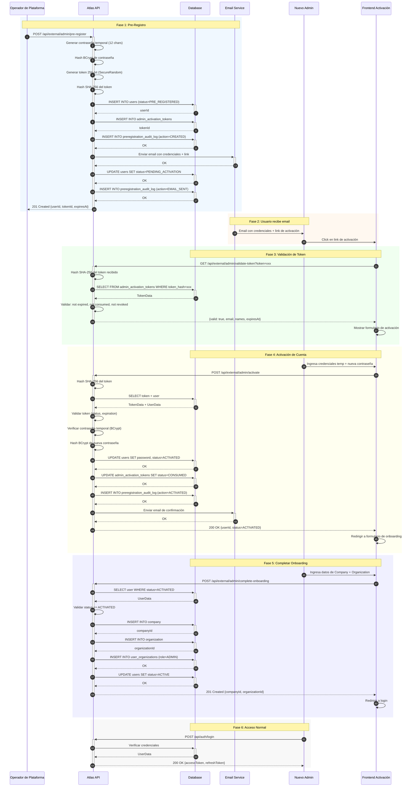

### 11.6 Diagrama de Máquina de Estados del Usuario

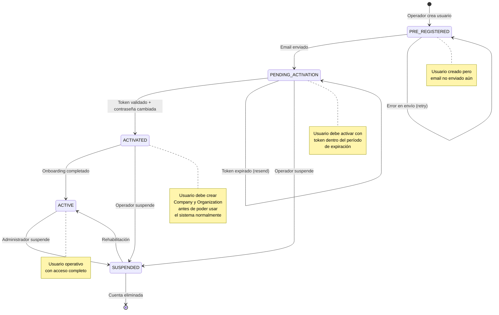

### 11.7 Diagrama de Máquina de Estados del Token

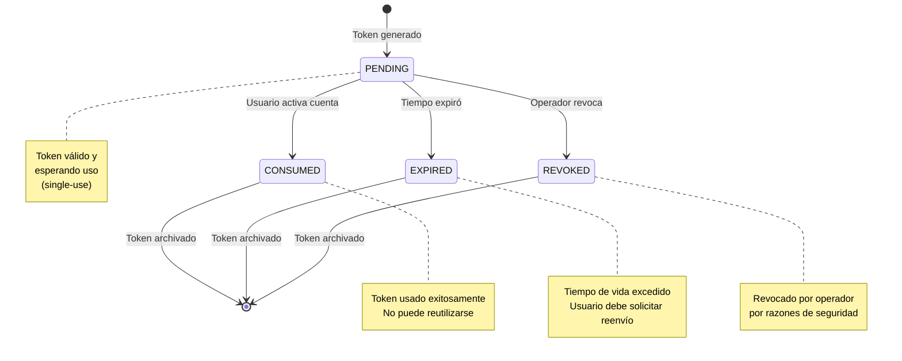

### 11.8 Diagrama de Componentes

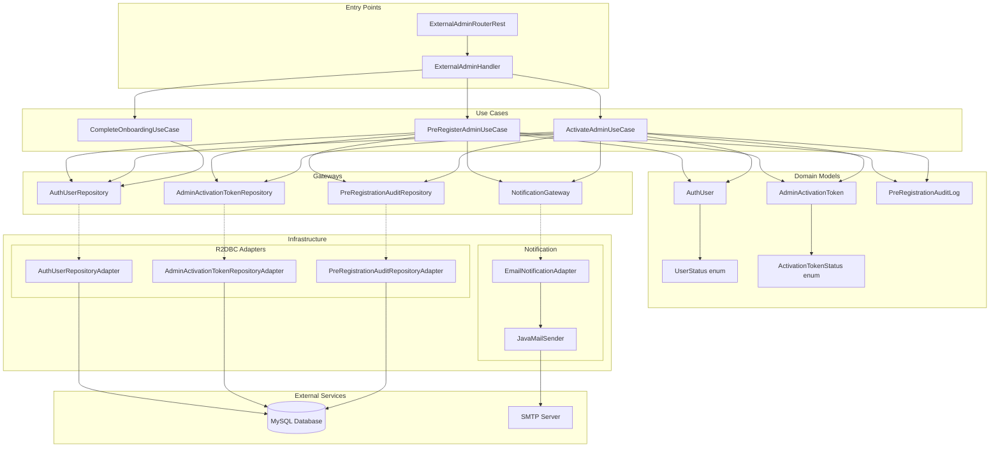

### 11.9 Seguridad

| Aspecto | Implementación |
|---------|----------------|
| **Contraseña temporal** | 12 caracteres, alfanumérico + símbolos, generada con `SecureRandom` |
| **Hash de contraseña** | BCrypt con strength factor configurable |
| **Token de activación** | 32 bytes (256 bits) generados con `SecureRandom` |
| **Almacenamiento de token** | Solo se almacena hash SHA-256, el token plano se envía por email |
| **Single-use** | Token se marca como `CONSUMED` tras uso exitoso |
| **Expiración** | Configurable (default 72 horas) |
| **Auditoría** | Todas las acciones registradas con IP, timestamp y actor |

### 11.10 Estructura de Tablas (Migración V5)

```sql
-- Tabla de tokens de activación
CREATE TABLE admin_activation_tokens (
    id BIGINT AUTO_INCREMENT PRIMARY KEY,
    token_hash VARCHAR(128) NOT NULL UNIQUE,  -- SHA-256 hash
    user_id BIGINT NOT NULL REFERENCES users(id),
    expires_at TIMESTAMP NOT NULL,
    consumed_at TIMESTAMP NULL,
    status ENUM('PENDING','CONSUMED','EXPIRED','REVOKED') NOT NULL DEFAULT 'PENDING',
    created_by VARCHAR(100) NOT NULL,         -- Operador ID
    created_at TIMESTAMP DEFAULT CURRENT_TIMESTAMP,
    created_ip VARCHAR(45),
    metadata JSON
);

-- Log de auditoría
CREATE TABLE preregistration_audit_log (
    id BIGINT AUTO_INCREMENT PRIMARY KEY,
    token_id BIGINT NOT NULL REFERENCES admin_activation_tokens(id),
    action ENUM('CREATED','EMAIL_SENT','ACTIVATED','EXPIRED','REVOKED','RESENT') NOT NULL,
    performed_by VARCHAR(100) NOT NULL,
    performed_at TIMESTAMP DEFAULT CURRENT_TIMESTAMP,
    client_ip VARCHAR(45),
    user_agent TEXT,
    details JSON
);

-- Extensión de users.status
ALTER TABLE users ADD COLUMN status ENUM(
    'ACTIVE',
    'PRE_REGISTERED',
    'PENDING_ACTIVATION',
    'ACTIVATED',
    'SUSPENDED'
) NOT NULL DEFAULT 'ACTIVE';
```

### 11.11 Configuración Requerida

```yaml
# application.yml
spring:
  mail:
    host: smtp.example.com
    port: 587
    username: ${MAIL_USERNAME}
    password: ${MAIL_PASSWORD}
    properties:
      mail.smtp.auth: true
      mail.smtp.starttls.enable: true

notification:
  enabled: true
  from-email: noreply@atlas-platform.com
  from-name: Atlas Platform

admin-preregistration:
  default-expiration-hours: 72
  password-length: 12
  token-bytes: 32
```

### 11.12 Permisos Requeridos

| Permiso | Descripción | Endpoint |
|---------|-------------|----------|
| `ADMIN_PREREGISTER_CREATE` | Crear pre-registro | POST /pre-register |
| `ADMIN_PREREGISTER_VIEW` | Ver pre-registros | GET (futuro) |
| `ADMIN_PREREGISTER_REVOKE` | Revocar tokens | DELETE (futuro) |
| `ADMIN_PREREGISTER_RESEND` | Reenviar email | POST (futuro) |

### 11.13 Validaciones de Seguridad

1. **Pre-registro**:
   - Email debe ser válido y único
   - Operador debe tener permiso `ADMIN_PREREGISTER_CREATE`
   - IP del operador se registra

2. **Validación de token**:
   - Token no expirado
   - Token no consumido
   - Token no revocado

3. **Activación**:
   - Token válido (todas las validaciones anteriores)
   - Email coincide con usuario del token
   - Contraseña temporal correcta (verificación BCrypt)
   - Nueva contraseña cumple políticas

4. **Onboarding**:
   - Usuario existe
   - Estado es `ACTIVATED` (no otro)
   - Sin token válido previo: **PROHIBIDO crear Company/Org**

---

## Apéndice A: Claims del JWT

El JWT generado por el sistema contiene los siguientes claims:

| Claim | Tipo | Descripción |
|-------|------|-------------|
| sub | String | User ID |
| email | String | Email del usuario |
| names | String | Nombre completo |
| organizationId | Long | ID de la organización actual |
| role | String | Rol principal (code) |
| roles | Array<String> | Todos los códigos de roles |
| permissions | Array<String> | Todos los códigos de permisos |
| enabledModules | Array<String> | Módulos habilitados para la org |
| iat | Long | Issued at (timestamp) |
| exp | Long | Expiration (timestamp) |

**Referencia**: `jwt/JwtTokenAdapter.java`

---

## Apéndice B: Códigos de Error

| Código | HTTP | Mensaje |
|--------|------|---------|
| AUTH_001 | 401 | Credenciales inválidas |
| TOKEN_001 | 400 | Token inválido o expirado |
| TOKEN_002 | 400 | Error al verificar token |

---

*Documento generado: 2026-02-07*
*Fuente de verdad: Migraciones Flyway V1-V3*
*Última actualización del código: AuthHandler.java, LoginUseCase.java*
