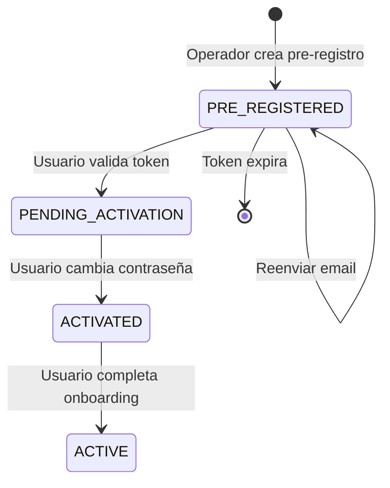
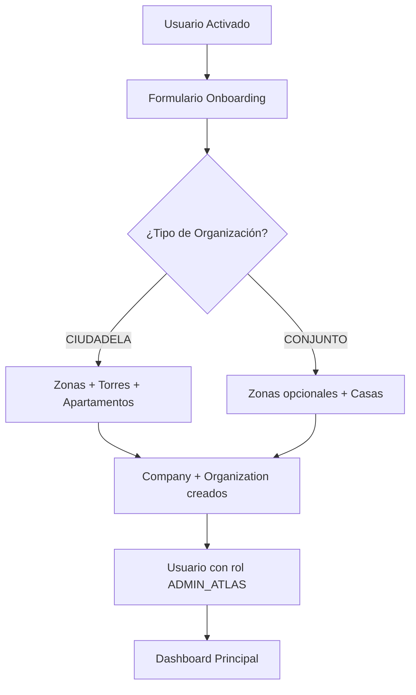
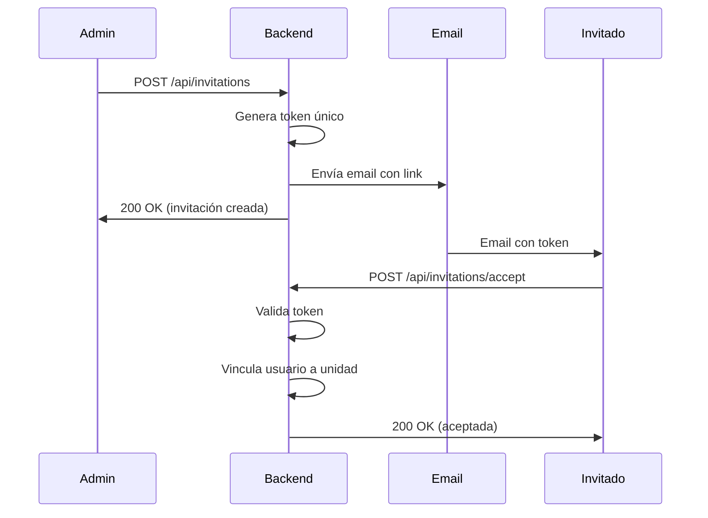
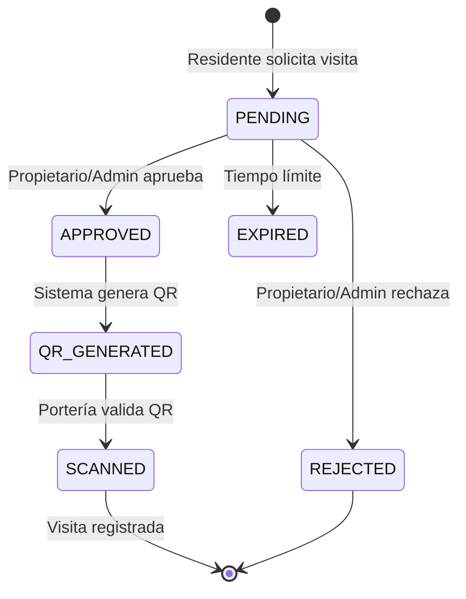
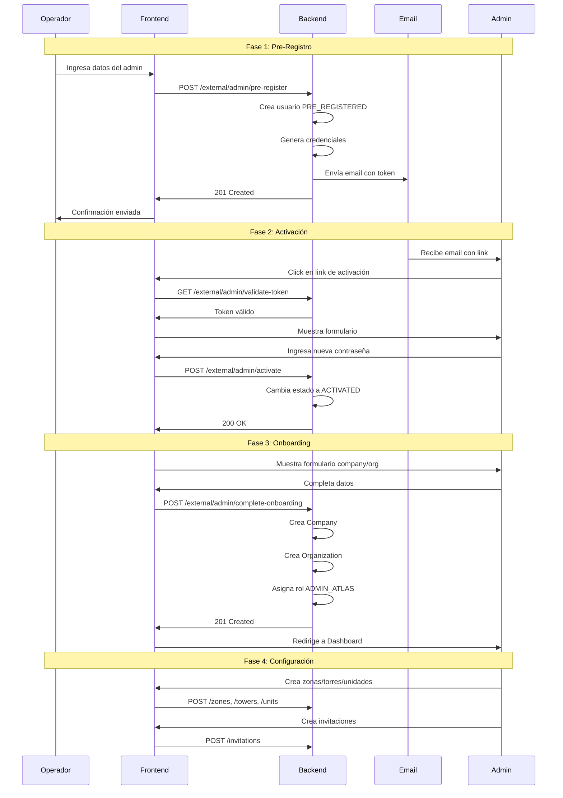

# Atlas Platform - Guía de Integración Frontend

## Tabla de Contenidos

1. [Resumen del Sistema](#1-resumen-del-sistema)
2. [Flujo 1: Pre-Registro y Activación de Administrador](#2-flujo-1-pre-registro-y-activación-de-administrador)
3. [Flujo 2: Onboarding - Configuración de Company y Conjunto](#3-flujo-2-onboarding---configuración-de-company-y-conjunto)
4. [Flujo 3: Configuración de Estructura Residencial](#4-flujo-3-configuración-de-estructura-residencial)
5. [Flujo 4: Invitaciones a Propietarios/Residentes](#5-flujo-4-invitaciones-a-propietariosresidentes)
6. [Flujo 5: Publicaciones y Comentarios](#6-flujo-5-publicaciones-y-comentarios)
7. [Flujo 6: Encuestas y Votaciones](#7-flujo-6-encuestas-y-votaciones)
8. [Flujo 7: Control de Visitas](#8-flujo-7-control-de-visitas)
9. [Sistema de Permisos](#9-sistema-de-permisos)
10. [Catálogo de Endpoints](#10-catálogo-de-endpoints)
11. [Diagramas de Secuencia](#11-diagramas-de-secuencia)

---

## 1. Resumen del Sistema

**Atlas Platform** es un backend para administración de organizaciones residenciales que soporta:

| Tipo | Estructura |
|------|------------|
| **Ciudadela** | Zonas → Torres → Apartamentos |
| **Conjunto Cerrado** | Zonas (opcional) → Casas |

### 1.1 Roles del Sistema

| Rol | Código | Descripción |
|-----|--------|-------------|
| Super Administrador | `SUPER_ADMIN` | Acceso total al sistema |
| Administrador Atlas | `ADMIN_ATLAS` | Administrador de organización residencial |
| Propietario | `OWNER` | Propietario de unidad |
| Arrendatario | `TENANT` | Arrendatario de unidad |
| Familiar | `FAMILY` | Familiar o residente secundario |
| Invitado | `GUEST` | Invitado temporal |
| Seguridad | `SECURITY` | Personal de seguridad/portería |

### 1.2 Módulos del Sistema

| Módulo | Código | Descripción |
|--------|--------|-------------|
| Atlas Core | `ATLAS_CORE` | Gestión de organizaciones, zonas, torres, unidades |
| Control de Visitas | `VISIT_CONTROL` | Solicitudes y aprobación de visitas |
| Control de Acceso | `ACCESS_CONTROL` | Generación y validación de códigos QR |

---

## 2. Flujo 1: Pre-Registro y Activación de Administrador

Este flujo permite a operadores de la plataforma crear administradores de conjuntos residenciales sin que estos tengan que auto-registrarse.

### 2.1 Diagrama de Estados del Usuario



### 2.2 Paso 1: Operador Pre-Registra al Administrador

**Endpoint:** `POST /api/external/admin/pre-register`

**Headers:**
```
Content-Type: application/json
X-Operator-Id: {operatorId}  // ID del operador que realiza la acción
```

**Request Body:**
```json
{
  "email": "admin@conjunto-ejemplo.com",
  "names": "Juan Pérez García",
  "phone": "+57 300 123 4567",
  "expirationHours": 72,
  "activationBaseUrl": "https://app.atlasplatform.com/activate",
  "metadata": "{\"companyNameSuggestion\": \"Conjunto Residencial El Roble\", \"organizationNameSuggestion\": \"Conjunto El Roble\"}"
}
```

**Response (201 Created):**
```json
{
  "success": true,
  "status": 201,
  "message": "Administrador pre-registrado exitosamente",
  "data": {
    "userId": 15,
    "tokenId": 8,
    "email": "admin@conjunto-ejemplo.com",
    "names": "Juan Pérez García",
    "expiresAt": "2026-02-10T14:30:00Z",
    "message": "Se ha enviado un email con las credenciales..."
  }
}
```

**Acciones del Sistema:**
1. Crea usuario con estado `PRE_REGISTERED`
2. Genera contraseña temporal segura
3. Genera token de activación con hash
4. Envía email con:
   - Credenciales temporales
   - Link de activación: `{activationBaseUrl}?token={token}`
5. Registra acción en log de auditoría

---

### 2.3 Paso 2: Usuario Valida Token (Frontend)

**Endpoint:** `GET /api/external/admin/validate-token?token={token}`

**Response (200 OK):**
```json
{
  "success": true,
  "status": 200,
  "message": "Token válido",
  "data": {
    "valid": true,
    "email": "admin@conjunto-ejemplo.com",
    "names": "Juan Pérez García",
    "expiresAt": "2026-02-10T14:30:00Z"
  }
}
```

**Response (Token Inválido):**
```json
{
  "success": true,
  "status": 200,
  "message": "Token inválido",
  "data": {
    "valid": false,
    "email": null,
    "names": null,
    "expiresAt": null
  }
}
```

**Lógica del Frontend:**
- Si `valid: true` → Mostrar formulario de activación
- Si `valid: false` → Mostrar mensaje de error y opción de solicitar reenvío

---

### 2.4 Paso 3: Usuario Activa su Cuenta

**Endpoint:** `POST /api/external/admin/activate`

**Request Body:**
```json
{
  "token": "abc123...xyz789",
  "email": "admin@conjunto-ejemplo.com",
  "currentPassword": "TempPass@2026#Abc",
  "newPassword": "MiNuevaContraseña@2026!"
}
```

**Response (200 OK):**
```json
{
  "success": true,
  "status": 200,
  "message": "Cuenta activada exitosamente",
  "data": {
    "userId": 15,
    "email": "admin@conjunto-ejemplo.com",
    "names": "Juan Pérez García",
    "status": "ACTIVATED",
    "message": "Su cuenta ha sido activada. Ahora puede completar la configuración de su organización."
  }
}
```

**Validaciones:**
- Token debe ser válido y no expirado
- `currentPassword` debe coincidir con la contraseña temporal
- `newPassword` debe cumplir políticas de seguridad

---

### 2.5 Paso 4: Reenviar Email de Pre-Registro (Opcional)

**Endpoint:** `POST /api/external/admin/resend`

**Headers:**
```
Content-Type: application/json
X-Operator-Id: {operatorId}
```

**Request Body:**
```json
{
  "email": "admin@conjunto-ejemplo.com",
  "activationBaseUrl": "https://app.atlasplatform.com/activate",
  "expirationHours": 72
}
```

**Response (200 OK):**
```json
{
  "success": true,
  "status": 200,
  "message": "Email reenviado exitosamente",
  "data": {
    "userId": 15,
    "tokenId": 9,
    "email": "admin@conjunto-ejemplo.com",
    "names": "Juan Pérez García",
    "expiresAt": "2026-02-10T14:30:00Z",
    "message": "Se ha reenviado el email con nuevas credenciales"
  }
}
```

---

## 3. Flujo 2: Onboarding - Configuración de Company y Conjunto

Después de activar la cuenta, el administrador debe crear su Company y Organization.

### 3.1 Diagrama del Flujo



### 3.2 Completar Onboarding

**Endpoint:** `POST /api/external/admin/complete-onboarding`

**Request Body:**
```json
{
  "userId": 15,
  "companyName": "Administradora Conjuntos Bogotá SAS",
  "companyTaxId": "900.123.456-7",
  "companyIndustry": "Administración de Propiedad Horizontal",
  "companyAddress": "Calle 100 # 15-20, Oficina 501",
  "companyCountry": "Colombia",
  "companyCity": "Bogotá",
  "organizationName": "Conjunto Residencial El Roble",
  "organizationCode": "CONJ-ROBLE-001",
  "organizationType": "CONJUNTO",
  "usesZones": false,
  "organizationDescription": "Conjunto residencial de 120 casas"
}
```

**Tipos de Organización:**
| Tipo | Valor | Descripción |
|------|-------|-------------|
| Ciudadela | `CIUDADELA` | Tiene zonas → torres → apartamentos |
| Conjunto | `CONJUNTO` | Tiene zonas (opcional) → casas |

**Response (201 Created):**
```json
{
  "success": true,
  "status": 201,
  "message": "Onboarding completado exitosamente",
  "data": {
    "companyId": 5,
    "companySlug": "administradora-conjuntos-bogota-sas",
    "organizationId": 12,
    "organizationCode": "CONJ-ROBLE-001",
    "message": "Company y Organization creados exitosamente. Puede comenzar a configurar su estructura."
  }
}
```

**Acciones del Sistema:**
1. Crea Company con datos proporcionados
2. Crea Organization vinculada a la Company
3. Habilita módulos por defecto (`ATLAS_CORE`, `VISIT_CONTROL`, `ACCESS_CONTROL`)
4. Vincula al usuario como miembro de la organización
5. Asigna rol `ADMIN_ATLAS` al usuario
6. Actualiza estado del usuario a `ACTIVE`

---

## 4. Flujo 3: Configuración de Estructura Residencial

Una vez completado el onboarding, el administrador configura la estructura física.

### 4.1 Para CIUDADELA (Zonas → Torres → Apartamentos)

#### 4.1.1 Crear Zonas

**Endpoint:** `POST /api/zones`

**Request:**
```json
{
  "organizationId": 12,
  "code": "ZONA-A",
  "name": "Zona A - Norte",
  "description": "Zona norte del conjunto",
  "sortOrder": 1
}
```

**Response:**
```json
{
  "success": true,
  "data": {
    "id": 1,
    "organizationId": 12,
    "code": "ZONA-A",
    "name": "Zona A - Norte",
    "sortOrder": 1,
    "isActive": true
  }
}
```

#### 4.1.2 Crear Torres

**Endpoint:** `POST /api/towers`

**Request:**
```json
{
  "zoneId": 1,
  "code": "TORRE-1",
  "name": "Torre 1",
  "floorsCount": 10,
  "description": "Torre principal",
  "sortOrder": 1
}
```

#### 4.1.3 Crear Apartamentos

**Endpoint:** `POST /api/units`

**Request:**
```json
{
  "organizationId": 12,
  "zoneId": 1,
  "towerId": 1,
  "code": "101",
  "type": "APARTMENT",
  "floor": 1,
  "areaSqm": 85.5,
  "bedrooms": 3,
  "bathrooms": 2,
  "parkingSpots": 1
}
```

---

### 4.2 Para CONJUNTO (Zonas opcionales → Casas)

#### 4.2.1 Crear Casas (Sin Zonas)

**Endpoint:** `POST /api/units`

**Request:**
```json
{
  "organizationId": 12,
  "zoneId": null,
  "towerId": null,
  "code": "CASA-1",
  "type": "HOUSE",
  "floor": null,
  "areaSqm": 120.0,
  "bedrooms": 4,
  "bathrooms": 3,
  "parkingSpots": 2
}
```

#### 4.2.2 Crear Casas (Con Zonas)

```json
{
  "organizationId": 12,
  "zoneId": 5,
  "towerId": null,
  "code": "CASA-15",
  "type": "HOUSE",
  "areaSqm": 150.0,
  "bedrooms": 5,
  "bathrooms": 4,
  "parkingSpots": 2
}
```

---

### 4.3 Endpoints de Estructura

| Recurso | Método | Endpoint | Descripción |
|---------|--------|----------|-------------|
| Zonas | GET | `/api/zones/organization/{orgId}` | Listar zonas de organización |
| Zonas | POST | `/api/zones` | Crear zona |
| Zonas | PUT | `/api/zones/{id}` | Actualizar zona |
| Zonas | DELETE | `/api/zones/{id}` | Eliminar zona |
| Torres | GET | `/api/towers/zone/{zoneId}` | Listar torres de zona |
| Torres | GET | `/api/towers/organization/{orgId}` | Listar todas las torres |
| Torres | POST | `/api/towers` | Crear torre |
| Torres | PUT | `/api/towers/{id}` | Actualizar torre |
| Torres | DELETE | `/api/towers/{id}` | Eliminar torre |
| Unidades | GET | `/api/units/organization/{orgId}` | Listar unidades de organización |
| Unidades | GET | `/api/units/tower/{towerId}` | Listar unidades de torre |
| Unidades | POST | `/api/units` | Crear unidad |
| Unidades | PUT | `/api/units/{id}` | Actualizar unidad |
| Unidades | DELETE | `/api/units/{id}` | Eliminar unidad |

---

## 5. Flujo 4: Invitaciones a Propietarios/Residentes

El administrador puede invitar a propietarios y residentes a las unidades.

### 5.1 Diagrama del Flujo de Invitación



### 5.2 Crear Invitación

**Endpoint:** `POST /api/invitations`

**Request:**
```json
{
  "organizationId": 12,
  "unitId": 25,
  "email": "propietario@email.com",
  "phoneNumber": "+57 310 555 1234",
  "type": "UNIT_OWNER",
  "roleId": 3
}
```

**Tipos de Invitación:**
| Tipo | Valor | Descripción |
|------|-------|-------------|
| Miembro de Organización | `ORG_MEMBER` | Acceso a nivel de organización |
| Propietario | `UNIT_OWNER` | Propietario de la unidad |
| Arrendatario | `UNIT_TENANT` | Arrendatario de la unidad |
| Familiar | `UNIT_FAMILY` | Familiar o residente secundario |

**Response:**
```json
{
  "success": true,
  "data": {
    "id": 45,
    "organizationId": 12,
    "unitId": 25,
    "email": "propietario@email.com",
    "type": "UNIT_OWNER",
    "status": "PENDING",
    "invitationToken": "inv_abc123...",
    "expiresAt": "2026-02-14T14:30:00Z"
  }
}
```

### 5.3 Aceptar Invitación

**Endpoint:** `POST /api/invitations/accept`

**Request:**
```json
{
  "token": "inv_abc123...",
  "userId": 30
}
```

**Response:**
```json
{
  "success": true,
  "message": "Invitación aceptada exitosamente",
  "data": {
    "unitId": 25,
    "role": "OWNER",
    "organizationId": 12
  }
}
```

### 5.4 Endpoints de Invitaciones

| Método | Endpoint | Descripción |
|--------|----------|-------------|
| POST | `/api/invitations` | Crear invitación |
| GET | `/api/invitations/{id}` | Obtener invitación por ID |
| GET | `/api/invitations/organization/{orgId}` | Listar por organización |
| GET | `/api/invitations/unit/{unitId}` | Listar por unidad |
| POST | `/api/invitations/accept` | Aceptar invitación |
| POST | `/api/invitations/{id}/cancel` | Cancelar invitación |
| POST | `/api/invitations/{id}/resend` | Reenviar invitación |

---

## 6. Flujo 5: Publicaciones y Comentarios

Los administradores pueden crear publicaciones y los residentes pueden comentar.

### 6.1 Crear Publicación

**Endpoint:** `POST /api/posts`

**Headers:**
```
X-User-Id: {userId}
Content-Type: application/json
```

**Request:**
```json
{
  "organizationId": 12,
  "title": "Reunión de Copropietarios",
  "content": "Se convoca a reunión ordinaria de copropietarios...",
  "type": "ANNOUNCEMENT",
  "allowComments": true,
  "isPinned": true
}
```

**Tipos de Publicación:**
| Tipo | Valor | Descripción |
|------|-------|-------------|
| Anuncio | `ANNOUNCEMENT` | Comunicados oficiales |
| Noticia | `NEWS` | Noticias del conjunto |
| Clasificado | `AD` | Avisos clasificados |

**Estados del Post:**
| Estado | Valor | Descripción |
|--------|-------|-------------|
| Borrador | `DRAFT` | No visible |
| Publicado | `PUBLISHED` | Visible para todos |
| Archivado | `ARCHIVED` | Ya no se muestra |

### 6.2 Publicar Post

**Endpoint:** `POST /api/posts/{id}/publish`

### 6.3 Crear Comentario

**Endpoint:** `POST /api/comments`

**Headers:**
```
X-User-Id: {userId}
```

**Request:**
```json
{
  "postId": 10,
  "content": "Excelente iniciativa, estaré presente.",
  "parentId": null
}
```

**Para responder a otro comentario:**
```json
{
  "postId": 10,
  "content": "De acuerdo contigo.",
  "parentId": 5
}
```

### 6.4 Endpoints de Posts y Comentarios

| Recurso | Método | Endpoint | Descripción |
|---------|--------|----------|-------------|
| Posts | POST | `/api/posts` | Crear post |
| Posts | GET | `/api/posts/{id}` | Obtener por ID |
| Posts | PUT | `/api/posts/{id}` | Actualizar post |
| Posts | DELETE | `/api/posts/{id}` | Eliminar post |
| Posts | GET | `/api/posts/organization/{orgId}` | Listar por organización |
| Posts | GET | `/api/posts/organization/{orgId}/published` | Listar publicados |
| Posts | POST | `/api/posts/{id}/publish` | Publicar |
| Posts | POST | `/api/posts/{id}/archive` | Archivar |
| Posts | POST | `/api/posts/{id}/toggle-pin` | Fijar/Desfijar |
| Comments | POST | `/api/comments` | Crear comentario |
| Comments | GET | `/api/comments/{id}` | Obtener por ID |
| Comments | DELETE | `/api/comments/{id}` | Eliminar |
| Comments | GET | `/api/comments/post/{postId}` | Listar por post |
| Comments | GET | `/api/comments/post/{postId}/count` | Contar por post |
| Comments | GET | `/api/comments/{parentId}/replies` | Obtener respuestas |

---

## 7. Flujo 6: Encuestas y Votaciones

### 7.1 Crear Encuesta

**Endpoint:** `POST /api/polls`

**Headers:**
```
X-User-Id: {userId}
```

**Request:**
```json
{
  "organizationId": 12,
  "title": "¿Cuál color prefiere para pintar las zonas comunes?",
  "description": "Seleccione su preferencia para la próxima renovación",
  "allowMultiple": false,
  "isAnonymous": true,
  "options": [
    "Blanco",
    "Beige",
    "Gris claro",
    "Verde menta"
  ],
  "startsAt": "2026-02-08T00:00:00Z",
  "endsAt": "2026-02-15T23:59:59Z"
}
```

**Estados de Encuesta:**
| Estado | Valor | Descripción |
|--------|-------|-------------|
| Borrador | `DRAFT` | No visible |
| Activa | `ACTIVE` | Aceptando votos |
| Cerrada | `CLOSED` | Votos finalizados |

### 7.2 Votar en Encuesta

**Endpoint:** `POST /api/polls/{id}/vote`

**Headers:**
```
X-User-Id: {userId}
```

**Request:**
```json
{
  "optionId": 3
}
```

### 7.3 Endpoints de Encuestas

| Método | Endpoint | Descripción |
|--------|----------|-------------|
| POST | `/api/polls` | Crear encuesta |
| GET | `/api/polls/{id}` | Obtener encuesta con resultados |
| GET | `/api/polls/organization/{orgId}` | Listar por organización |
| GET | `/api/polls/organization/{orgId}/active` | Listar activas |
| POST | `/api/polls/{id}/activate` | Activar encuesta |
| POST | `/api/polls/{id}/close` | Cerrar encuesta |
| POST | `/api/polls/{id}/vote` | Votar |

---

## 8. Flujo 7: Control de Visitas

### 8.1 Diagrama del Flujo de Visitas



### 8.2 Crear Solicitud de Visita

**Endpoint:** `POST /api/visits`

**Request:**
```json
{
  "organizationId": 12,
  "unitId": 25,
  "visitorName": "María García López",
  "visitorDocument": "1234567890",
  "visitorPhone": "+57 300 111 2233",
  "visitorEmail": "maria@email.com",
  "vehiclePlate": "ABC-123",
  "purpose": "Visita familiar",
  "validFrom": "2026-02-10T09:00:00Z",
  "validUntil": "2026-02-10T18:00:00Z",
  "recurrenceType": "ONCE",
  "maxEntries": 1,
  "notes": "Es mi madre"
}
```

**Tipos de Recurrencia:**
| Tipo | Valor | Descripción |
|------|-------|-------------|
| Una vez | `ONCE` | Visita única |
| Diaria | `DAILY` | Acceso diario |
| Semanal | `WEEKLY` | Días específicos |
| Mensual | `MONTHLY` | Acceso mensual |

### 8.3 Aprobar/Rechazar Visita

**Endpoint:** `POST /api/visits/{id}/approve`

**Request:**
```json
{
  "action": "APPROVED",
  "reason": null
}
```

**Para rechazar:**
```json
{
  "action": "REJECTED",
  "reason": "No autorizado por el propietario"
}
```

---

## 9. Sistema de Permisos

### 9.1 Matriz de Permisos por Rol

| Permiso | SUPER_ADMIN | ADMIN_ATLAS | OWNER | TENANT | FAMILY | GUEST | SECURITY |
|---------|:-----------:|:-----------:|:-----:|:------:|:------:|:-----:|:--------:|
| ORGANIZATIONS_CREATE | ✅ | ❌ | ❌ | ❌ | ❌ | ❌ | ❌ |
| ORGANIZATIONS_READ | ✅ | ✅ | ❌ | ❌ | ❌ | ❌ | ❌ |
| ORGANIZATIONS_UPDATE | ✅ | ✅ | ❌ | ❌ | ❌ | ❌ | ❌ |
| ZONES_CREATE | ✅ | ✅ | ❌ | ❌ | ❌ | ❌ | ❌ |
| ZONES_READ | ✅ | ✅ | ❌ | ❌ | ❌ | ❌ | ❌ |
| TOWERS_CREATE | ✅ | ✅ | ❌ | ❌ | ❌ | ❌ | ❌ |
| UNITS_MANAGE | ✅ | ✅ | ❌ | ❌ | ❌ | ❌ | ❌ |
| UNITS_READ | ✅ | ✅ | ✅ | ✅ | ✅ | ✅ | ❌ |
| USER_UNITS_CREATE | ✅ | ✅ | ✅ | ❌ | ❌ | ❌ | ❌ |
| INVITATIONS_CREATE | ✅ | ✅ | ✅ | ✅ | ❌ | ❌ | ❌ |
| VISITS_CREATE | ✅ | ❌ | ✅ | ✅ | ✅ | ❌ | ❌ |
| VISITS_APPROVE | ✅ | ✅ | ✅ | ✅ | ❌ | ❌ | ❌ |
| ACCESS_CODES_VALIDATE | ✅ | ❌ | ❌ | ❌ | ❌ | ❌ | ✅ |
| POSTS_CREATE | ✅ | ✅ | ❌ | ❌ | ❌ | ❌ | ❌ |
| POSTS_READ | ✅ | ✅ | ✅ | ✅ | ✅ | ❌ | ❌ |
| COMMENTS_CREATE | ✅ | ✅ | ✅ | ✅ | ✅ | ❌ | ❌ |
| POLLS_CREATE | ✅ | ✅ | ❌ | ❌ | ❌ | ❌ | ❌ |
| POLLS_VOTE | ✅ | ✅ | ✅ | ✅ | ✅ | ❌ | ❌ |

### 9.2 Permisos Adicionales por Unidad

Los usuarios pueden tener permisos adicionales específicos para una unidad a través de la tabla `user_unit_permissions`.

---

## 10. Catálogo de Endpoints

### 10.1 Autenticación

| Método | Endpoint | Descripción |
|--------|----------|-------------|
| POST | `/api/auth/register` | Registrar usuario |
| POST | `/api/auth/login` | Iniciar sesión |
| POST | `/api/auth/refresh` | Renovar token |
| POST | `/api/auth/verify-token` | Verificar token JWT |

### 10.2 Pre-Registro Externo

| Método | Endpoint | Descripción |
|--------|----------|-------------|
| POST | `/api/external/admin/pre-register` | Pre-registrar admin |
| GET | `/api/external/admin/validate-token` | Validar token |
| POST | `/api/external/admin/activate` | Activar cuenta |
| POST | `/api/external/admin/complete-onboarding` | Completar onboarding |
| POST | `/api/external/admin/resend` | Reenviar email |

### 10.3 Organizaciones

| Método | Endpoint | Descripción |
|--------|----------|-------------|
| POST | `/api/organizations` | Crear organización |
| GET | `/api/organizations/{id}` | Obtener por ID |
| GET | `/api/organizations` | Listar todas |
| GET | `/api/organizations/company/{companyId}` | Listar por company |
| PUT | `/api/organizations/{id}` | Actualizar |
| DELETE | `/api/organizations/{id}` | Eliminar |

### 10.4 Estructura (Zonas, Torres, Unidades)

Ver sección 4.3 para el catálogo completo.

### 10.5 Invitaciones

Ver sección 5.4 para el catálogo completo.

### 10.6 Posts y Comentarios

Ver sección 6.4 para el catálogo completo.

### 10.7 Encuestas

Ver sección 7.3 para el catálogo completo.

---

## 11. Diagramas de Secuencia

### 11.1 Flujo Completo: Pre-Registro hasta Configuración



---

## Anexos

### A. Headers Comunes

| Header | Descripción | Obligatorio |
|--------|-------------|:-----------:|
| `Authorization` | Bearer token JWT | Mayoría endpoints |
| `Content-Type` | `application/json` | POSTs/PUTs |
| `X-User-Id` | ID del usuario actual | Posts, Comments, Polls |
| `X-Organization-Id` | ID de organización en contexto | Multi-tenant |
| `X-Operator-Id` | ID del operador (pre-registro) | Pre-registro |

### B. Códigos de Error

| Código | Significado |
|--------|-------------|
| `REG_001` | Email ya registrado |
| `PREREGISTER_001` | Email ya pre-registrado |
| `PREREGISTER_002` | Datos de entrada inválidos |
| `VALIDATE_001` | Error validando token |
| `ACTIVATE_001` | Token expirado o inválido |
| `ACTIVATE_002` | Contraseña incorrecta |
| `ONBOARDING_001` | Usuario no autorizado |
| `ONBOARDING_002` | Datos de onboarding inválidos |
| `TOKEN_001` | Token JWT inválido |
| `TOKEN_002` | Error procesando token |

### C. Estructura de Respuesta API

**Respuesta Exitosa:**
```json
{
  "success": true,
  "status": 200,
  "message": "Operación exitosa",
  "data": { ... },
  "timestamp": "2026-02-07T14:30:00Z"
}
```

**Respuesta de Error:**
```json
{
  "success": false,
  "status": 400,
  "message": "Descripción del error",
  "path": "/api/endpoint",
  "metadata": {
    "errorCode": "ERROR_001"
  },
  "timestamp": "2026-02-07T14:30:00Z"
}
```
